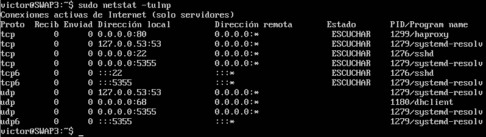

# Asegurar el sistema web

## Ejercicio 6.1
**Aplicar con iptables una política de denegar todo el tráfico en una de las máquinas de prácticas.**

Denegamos todo el tráfico entrante y saliente.

```
iptables −P INPUT DROP
iptables −P OUTPUT DROP
iptables −P FORWARD DROP
```

**Aplicar con iptables una política de permitir todo el tráfico en una de las máquinas de prácticas.**

Aceptamos todo el tráfico entrante y saliente.

```
iptables −P INPUT ACCEPT
iptables −P OUTPUT ACCEPT
iptables −P FORWARD ACCEPT
```


## Ejercicio 6.2
**Comprobar qué puertos tienen abiertos nuestras máquinas, su estado, y qué programa o demonio lo ocupa.**

Con el comando ``` netstat -tulnp ``` se pueden ver los puertos abiertos, que está usando cada servicio y su estado.



## Ejercicio 6.3
**Buscar información acerca de los tipos de ataques más comunes en servidores web (p.ej. secuestros de sesión). Detallar en qué consisten, y cómo se pueden evitar.**

* DDOS --> Es un ataque a un sistema de computadoras o red que causa que un servicio o recurso sea inaccesible a los usuarios legítimos. Para evitarlos cuando se realicen los ataques, se bloquean las IPs de los atacantes, con DDoS Deflate se puede realizar automáticamente, ya que es un script que bloquea las IPs que realizan más de un número determinado de solicitudes y las bloquea temporalmente.

* Inyección SQL --> Es un método de infiltración de código intruso que se vale de una vulnerabilidad informática presente en una aplicación en el nivel de validación de las entradas para realizar operaciones sobre el servidor. Se puede evitar en al programación, al impedir que cualquier carácter o solicitud no preparada, surja efecto.

* Fuerza bruta --> Es la forma de recuperar una clave probando todas las combinaciones posibles hasta encontrar aquella que permite el acceso. No utilizar contraseñas predefinidas o las más usadas en la red, que sea aleatoria y con gran cantidad de caracteres.
