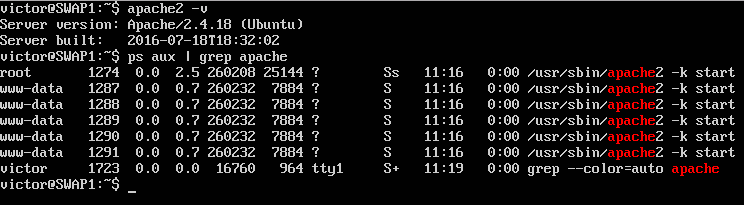
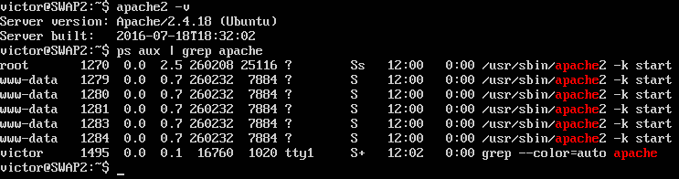
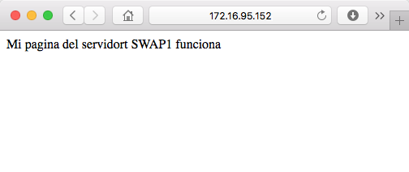
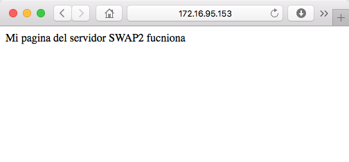

# Práctica 1 - Instalación máquinas virtuales

Se han creado las dos máquinas virtuales, llamadas SWAP1 y SWAP2, en ambas se han instalado LAMP y ssh, como se puede ver a continuación:

* SWAP1

* SWAP2

También se ha comprobado que se puede acceder a ellas desde el SO anfitrión:

* SWAP1

* SWAP2

