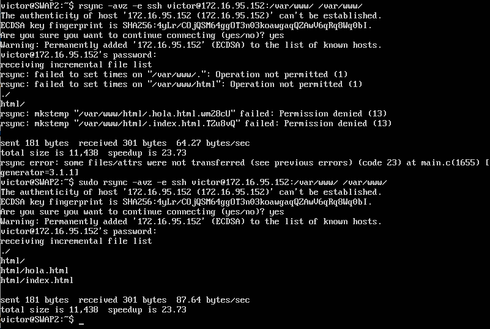
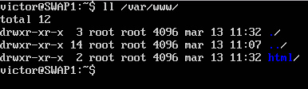
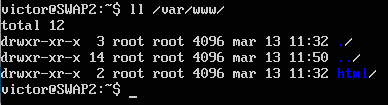
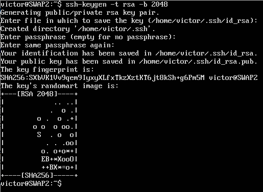
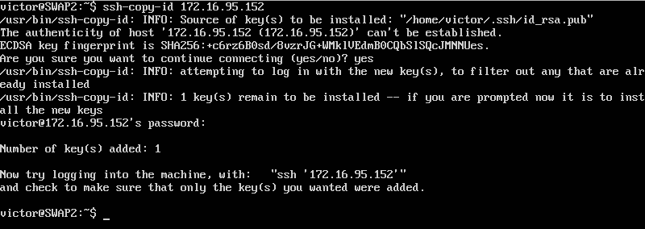
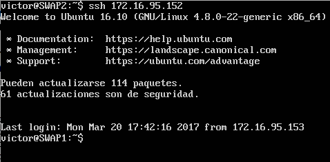
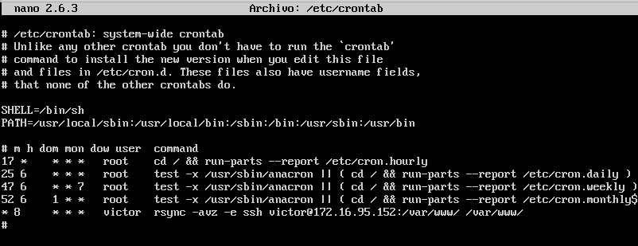

# Práctica 2 - Clonar la información de un sitio web

## rsync

Una vez instalado en ambas máquinas el rsync, se comprueba el funcionamiento de este desde la máquina
2 a la 1.

Como se puede ver, el contenido de la máquina 1, ha copiado en la máquina 2.

* SWAP1

* SWAP2

## ssh sin clave

Para poder conectarnos sin clave desde la máquina 2 a la 1, es necesario que introduzcamos la clave
pública de la máquina 2 en la 1, para ello primero generamos la clave:

Una vez creada la clave es necesario introducirla en la máquina principal, para que no sea necesario
la introducción de la contraseña para que se pueda conectar.

Teniendo ya la clave introducida tan solo nos conetactaremos y no hará falta introducir la clave.

## cron

Para que una tarea se nos reproduzca cada X tiempo, es necesario modificar el archivo /etc/crontab con
los datos de cada cuanto queremos que lo realice y que ha de realizar. En este caso va a ser que se realice
a las 8 de la mañana durante todo el año.

