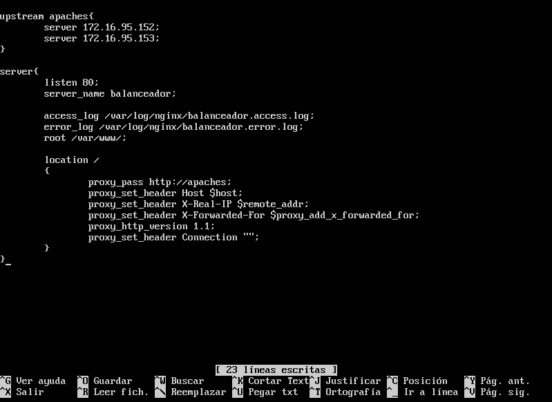
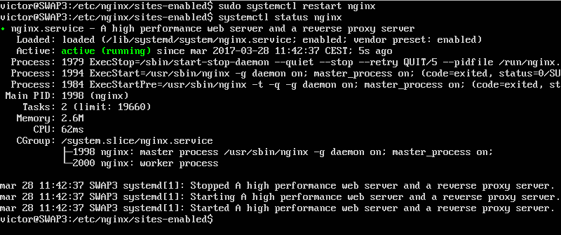
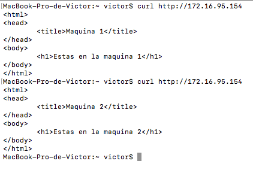
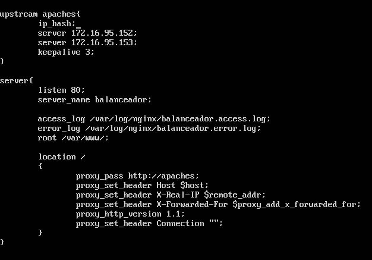
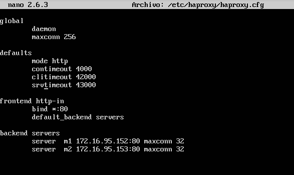
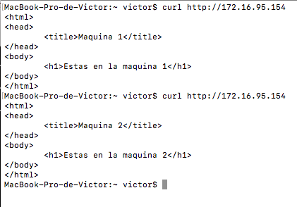
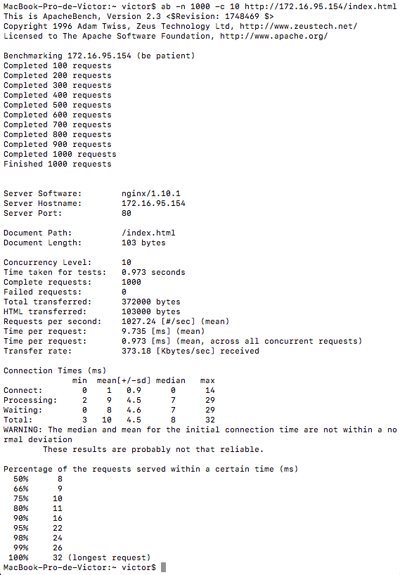

# Práctica 3 - Balanceador de carga

Creamos una tercera máquina igual que las otras, pero sin apache.


## nginx

Una vez instalado nginx, nos vamos al directorio ```/etc/nginx/conf.d/ ``` y creamos el archivo ``` default.conf ``` con la información de nuestros servidores a los que se les va hacer el balanceo, y toda la información para que el servidor sepa donde escuchar, un nombre del servidor, los logs de acceso y error, el directorio de root y la localización de los proxy.  
Es importante indicar que la versión de http sea 1.1 para evitarnos errores, y que la cabecera de envío a los servidores de balanceo este vacía.



Antes de volver a lanzar el servicio eliminaremos ``` /etc/nginx/sites-enable/default ```, para que de esta forma no nos mande a su web inicial y use el balanceador para redirigirnos a nuestros servidores.

Reiniciamos el servicio de nginx.



Una vez vemos que funciona perfectamente haciendole peticiones al balanceador desde nuestro ordenador con ``` curl ```.



Haremos unas pequeñas modificaciones para que un usuario que ha iniciado una sesión en una máquina no la pierda, para ello añadimos en nuestro archivo de configuración del balanceador ``` ip_hash ``` antes de la dirección de nuestras máquinas.  
También añadiremos después de las máquinas ``` keepalive ``` con valor 3, para indicar que son 3 segundos de vida a las conexiones de una persistencia de múltiples peticiones HTTP.




## haproxy

Una vez instalado haproxy y detenido el servido de nginx para que al configurarlo y activarlo no cause problemas nos dirigimos al archivo ``` /etc/haproxy/haproxy.cfg ``` para editarlo y dejarlo de la siguiente forma:



En la parte global indicamos el daemon y el máximo de conexiones. En la parte por defecto indicamos el modo de conexión, el timeout de conexión, cliente y servidor. En la parte frontend en que puerto se ha de estar escuchando y el nombre del conjunto de máquinas a las que hacemos el balanceo. En las máquinas definimos un nombre para cada una, el puerto por el que escuchan y el número máximo de conexiones.

Ahora se lanza el sistema de la siguiente forma ``` sudo /usr/sbin/haproxy -f /etc/haproxy/haproxy.cfg ```.

Desde nuestro ordenador comprobamos que funciona haciendole peticiones.




## Someter a una alta carga en el servidor de balanceo

Para someter al servidor de balanceo a una gran carga de trabajo, usaremos Apache Benchmark estando activo en cada ocasión uno de los balanceadores, se usara este comando para realizarlo en cada ocasión: ``` ab -n 1000 -c 10 http://172.16.95.154/index.html ```

|   | nginx | haproxy |
|:-:|:-:|:-:|
| Tiempo ocupado por test (seg) | 0.973 | 1.362 |
| Respuestas por segundo | 1027.24 | 734.02 |
| Tiempo medio por respuesta concurrente (ms) | 9.735 | 13.624 |
| Ratio transferido (KB/seg) | 373.18 | 267.37 |
| HTML transferido (bytes) | 103000 | 103000 |
| Total transferido (bytes) | 372000 | 373000 |

* Sobrecarga nginx



* Sobrecarga haproxy


