# Práctica 4 - Seguridad

En esta práctica se va habilitar una conexión segura para https y la activación de cortafuegos

## Instalar un certificado autofirmado SSL

Para instalar un certificado ssl antes debemos activar en apache el uso de estos mediante el comando ```a2enmod ssl``` y reiniciar el servicio apache. Después se creara una para albergar los certificados ssl en el directorio ```/etc/apache/ssl```.

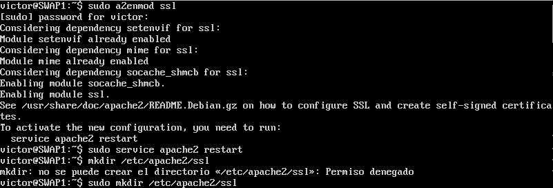

Después crearemos el certificado para poder incorporarlo a nuestro servidor, dentro del directorio creado introducimos el siguiente comando: ```openssl req -x509 -nodes -days 365 -newkey rsa:2048 -keyout /etc/apache2/ssl/apache.key -out /etc/apache2/ssl/apache.crt```, nos pedirá el país, ciudad, datos sobre la organización y un mail.

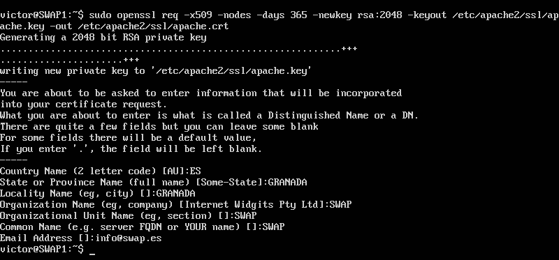

Editamos el archivo ```/etc/apache2/sites-avaliable/default-ssl``` y le añadimos dos líneas donde pone SSLEngine.

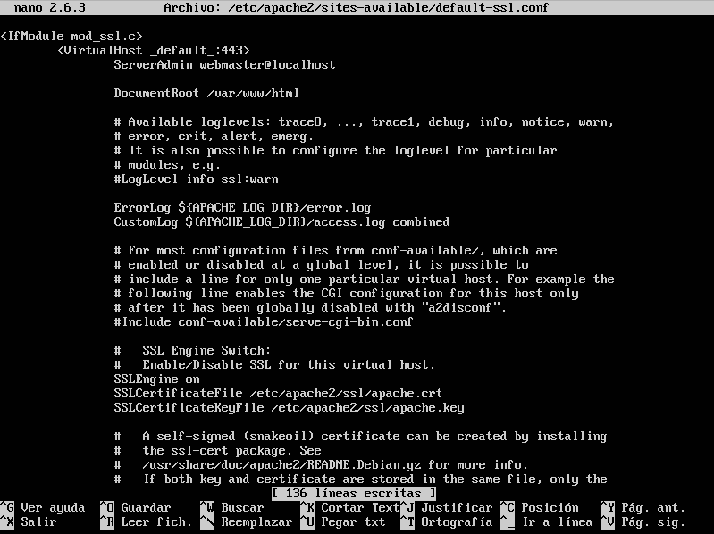

Activamos el el ssl en apache y lo reiniciamos.

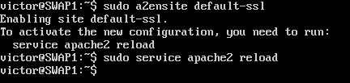

Una vez hecho todo esto, vamos al navegador a comprobar que funciona el https.

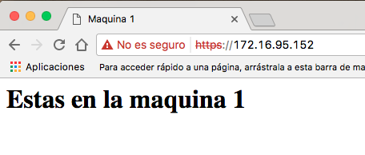

Para la maquina 2 se realiza los mismos pasos, salvo que reutilizaremos los dos dos certificados creados en el maquina 1 copiándolos con scp.


## Configurar el cortafuegos

Se va a usar iptables para el cortafuegos, primero veremos que no tenemos ninguna regla ya escrita y que el cortafuegos esta limpio con ```iptables -L -n -v```

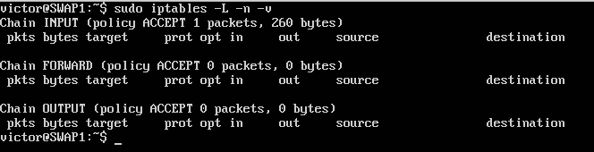

Y comprobamos que podemos acceder sin problemas.

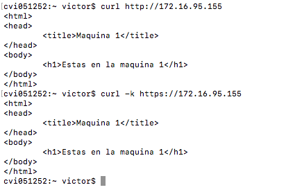

Creamos un script con las reglas para nuestro cortafuegos.

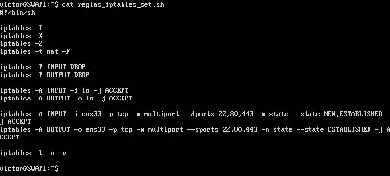

iptables -F -> Vacía las reglas de la cadena  
iptables -X -> Borra la cadena vacía  
iptables -Z -> Poner a cero los contadores de paquetes y bytes de todas las reglas de una cadena  
iptables -t nat -F -> Vacía las reglas de la cadena de las interfaces  

iptables -P INPUT DROP -> Deniega cualquier conexión entrante  
iptables -P OUTPUT DROP -> Deniega cualquier conexión saliente  

iptables -A INPUT -i lo -j ACCEPT -> Añade el permiso de entrada para las conexiones locales  
iptables -A OUTPUT -i lo -j ACCEPT -> Añade el permiso de salida para las conexiones locales  

iptables -A INPUT -i ens33 -p tcp -m multiport --dports 22,80,443 -m state --state NEW,ESTABLISHED -j ACCEPT -> Añade el permiso de conexiones entrantes para la interfaz ens33 de tipo tcp a los puertos 22, 80 y 443 para las conexiones nuevas o ya establecidas.  
iptables -A OUTPUT -o ens33 -p tcp -m multiport --dports 22,80,443 -m state --state ESTABLISHED -j ACCEPT ->  Añade el permiso de conexiones salientes para la interfaz ens33 de tipo tcp a los puertos 22, 80 y 443 para las conexiones ya establecidas.

Una vez creadas nos saldran todas las reglas con el comando anterior para ver el cortafuegos.

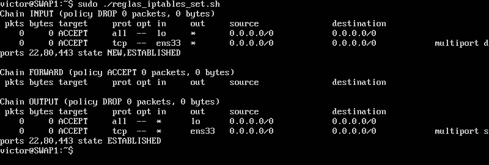

Probamos de nuevo a ver si podemos acceder.

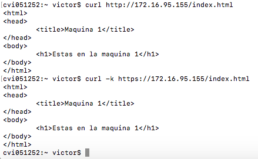

Pos si nos hubiéramos equivocado, creamos un script para dejar limpio el cortafuegos y volver a empezar todo.

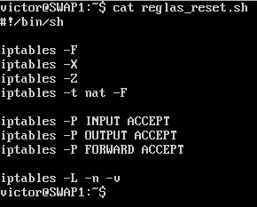

Quedándose como al principio.
