# Práctica 5. Replicación de bases de datos MySQL

Para esta práctica se va a crear una base datos actualizada maestro-esclavo.

## Crear BD e insertar datos

Accedemos a la BD con la instrucción: ``` mysql -u root -p ```

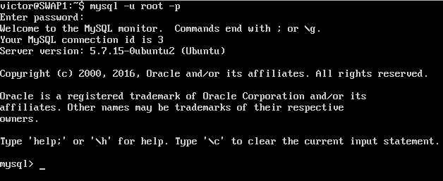

Una vez dentro ya podemos empezar a trabajar en un entorno SQL, por tanto, lo primero es crear la BD, seleccionarla y luego las tablas con sus datos.

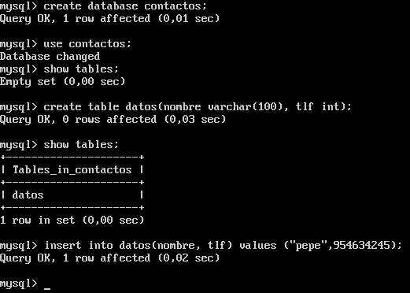

Para comprobar que la inserción en la tabla ha sido correcta, realizamos la consulta de la tabla.

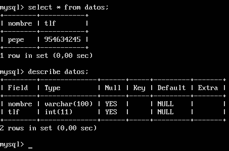

Una vez esto bloqueamos la BD para que no se puedan realizar más cambios hasta que terminemos la replicación.

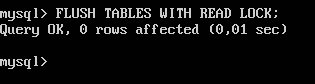

Salimos con ``` quit ```.


## Clonar BD

Necesitamos clonar la base de datos en un archivo para que podamos exportarla e insetarla en el esclavo para que al inicio todo este igual, cambiamos al usuario root para poder hacer todo a partir de aquí e introducir: ``` mysqldump contactos -u root -p > /root/contactos.sql ```

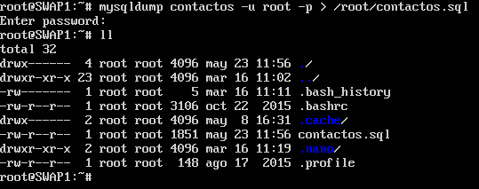

Una vez clonado tan solo necesitamos mover el archivo a la máquina esclava para realizar el proceso contrario.


Accedemos a mysql de la máquina esclavo y creamos la BD con el mismo nombre que en el maestro, ya que esta es la única instrucción que no se ha copiado en el archivo.

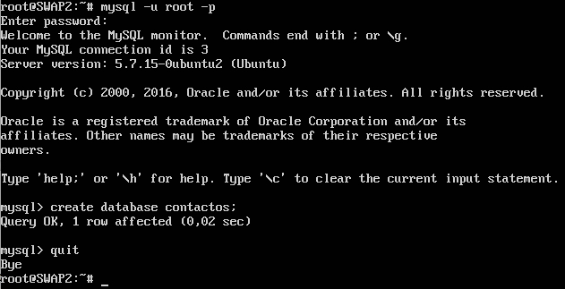

Salimos y agregamos el archivo a mysql con: ``` mysql -u root -p contactos < /root/contactos ```

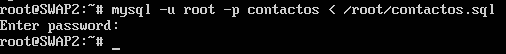

Entramos de nuevo en mysql para hacer una consulta y comprobar que todo esta igual que el maestro.

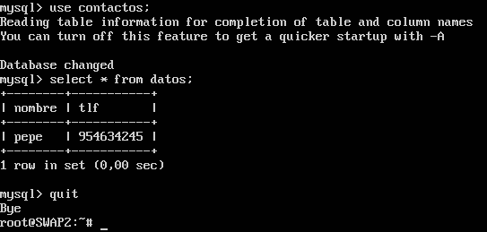

Ya tenemos el clonado hecho.


## Replicar maestro-esclavo

En la máquina maestro editamos el archivo ``` /etc/mysql/mysql.conf.d/mysql.cnf ``` y en este comentamos la línea ``` bind-address ```, descomentamos las líneas ``` server-id ```, que debe de estar a 1, y ``` log_bin ```. Nos aseguramos que la línea ``` log_error = /var/log/mysql/error.log ``` es correcta.

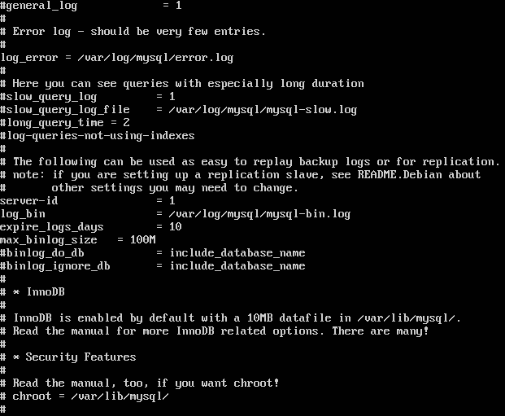

Reiniciamos el servido mysql.

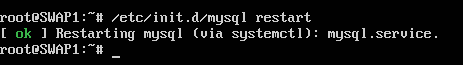

Hacemos lo mismo en el esclavo, pero el ``` server-id ``` ha de ser 2.

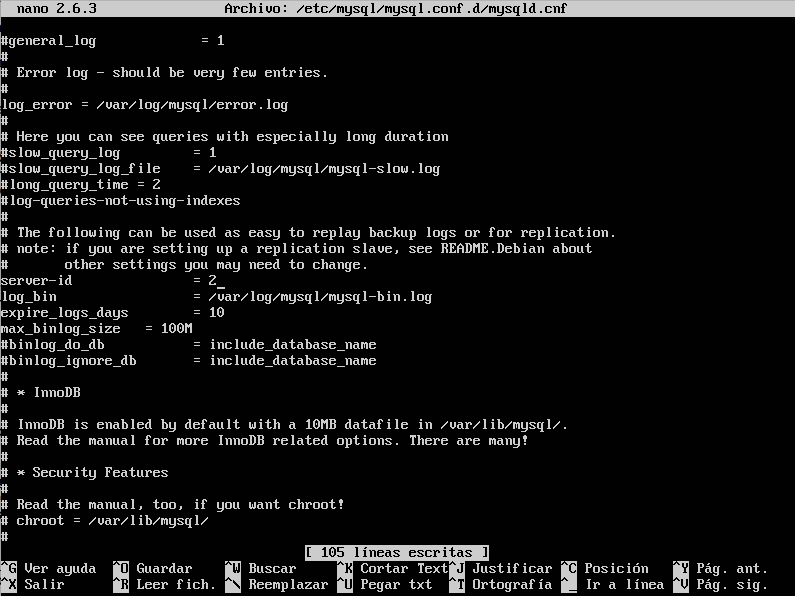

Y reiniciamos el servicio mysql.

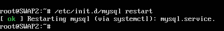

Ahora creamos el usuario esclavo con sus permisos en el maestro.
```
> CREATE USER esclavo IDENTIFIED 'esclavo';
> GRANT REPLICATION SLAVE ON *.* TO 'esclavo'@'%' IDENTIFIED 'esclavo';
> FLUSH PRIVILEGES;
> FLUSH TABLES;
> FLUSH TABLES WITH READ LOCK;
```

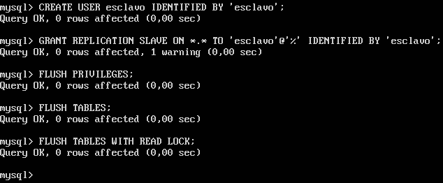

Obtenemos los datos de la BD maestro para indicarla luego en el esclavo: ``` SHOW MASTER STATUS ```

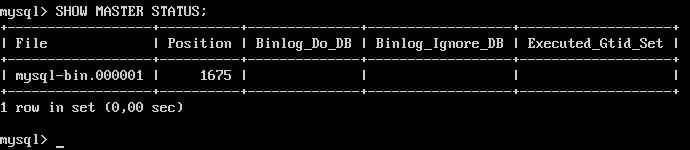

Nos vamos a la máquina esclavo para indicarle los datos de maestro, para que este replicada, introducimos: ``` CHANGE MASTER TO MASTER_HOST='172.16.95.155', MASTER_USER='esclavo', MASTER_PASSWORD='esclavo', MASTER_LOG_FILE='mysql-bin.000001', MASTER_LOG_POS=1675, MASTER_PORT=3306; ```

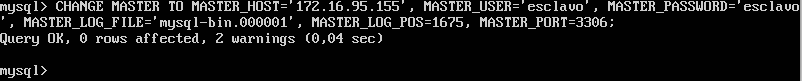

Iniciamos el esclavo ``` START SLAVE ```

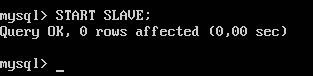

Mostramos los valores de esclavo para asegurarnos de que la replicación esta bien hecha y nos fijamos en el valor ``` Seconds_Behind_Master ```, debemos comprobar que este valor no indica NULL y por tanto eso nos dice que es correcta la replicación, en caso contrario los diferentes parámetros nos indicarían que sucede.

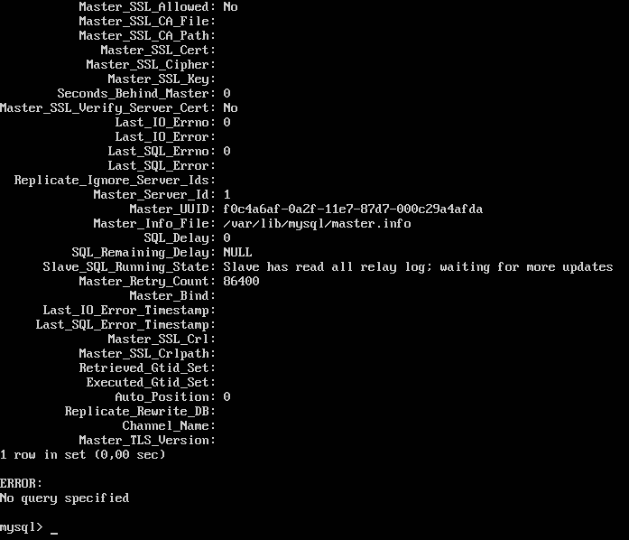

Nos volvemos al maestro y desbloqueamos las tablas ``` UNLOCK TABLES ```

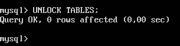

Insertamos datos para comprobar que se replican bien.

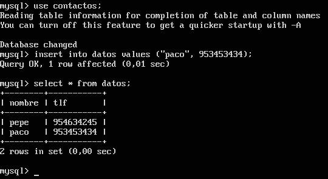

Y en el esclavo hacemos lo propio para verificar que todo se ha copiado correctamente.

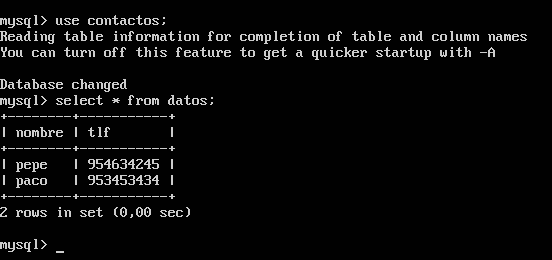
