## Práctica 6 - Discos RAID

En esta práctica vamos a ver como crear discos RAID y simular fallos en ellos para realizar operaciones de mantenimiento.

## Instalación y configuración

Antes de encender la máquina, se añaden dos discos de iguales características.


Arrancamos la máquina e instalamos el mdadm con el comando ``` sudo apt-get install mdadm ```. Una vez instalado, vamos a verificar que los discos aparecen y cuales son sus nombres, con ```sudo fdisk -l ``` vemos que los discos son de 20GB cada uno y que se nombran sdb y sdc.

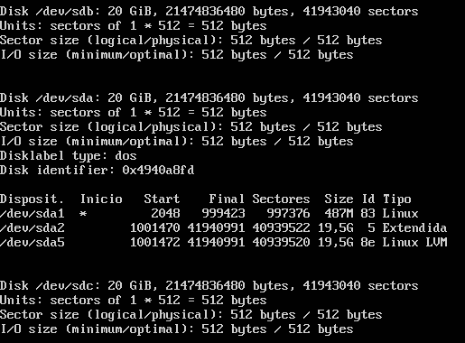

Ahora creamos el RAID que se va a llamar ``` md0 ``` con la siguiente instrucción; ``` sudo mdadm -C /dev/md0 --level=raid1 --raid-devices=2 /dev/sdb /dev/sdc ```

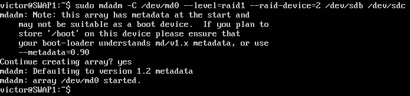

Con ``` fdisk ``` vemos el estado del disco creado.

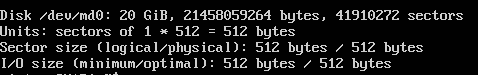

Ahora falta darle formato al disco, al no especificarle cual, el sistema le dará ext2: ``` sudo mkfs /dev/md0 ```

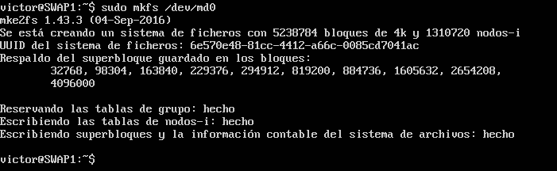

Montamos el disco en un directorio creado para ello.

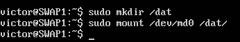

Y con ``` sudo mount ``` podemos ver el estado de este.

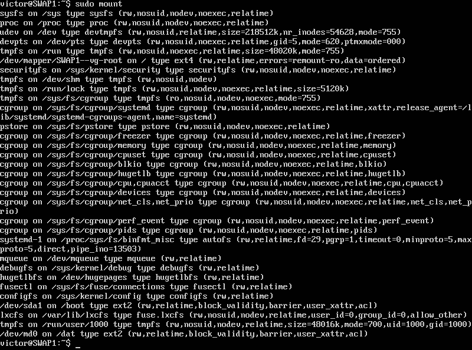

Para poder ver el estado del disco usaremos ``` sudo mdadm --detail /dev/md0 ```

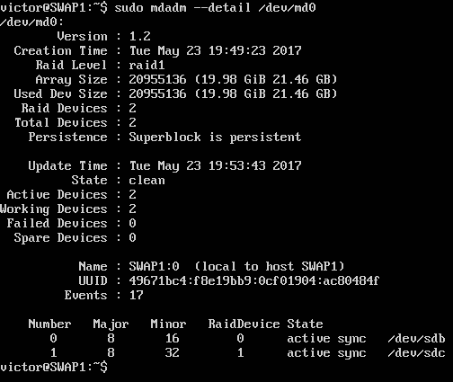

Ahora solo nos falta que se agregue automáticamente cada vez que iniciamos el sistema, para ello primero buscamos su identificador para agregarlo de esta forma y no por el nombre, ya que este podría sufrir cambios:  ``` ls -l /dev/disk/by-uuid ```

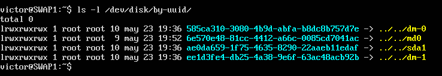

Ahora modificamos el archivo ``` /etc/fstab ``` y agregamos la siguiente línea ``` UUID=6e590e48-81cc-4412-a66c-0085cd7041ac /dat ext2 defaults 0 0 ```

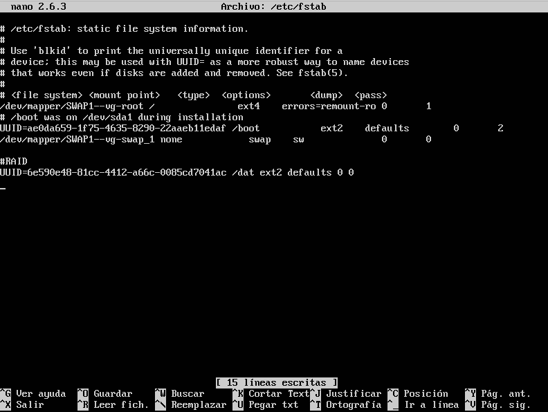

Y ya estaría.


## Simular mantenimiento

Vamos a simular un fallo en un disco y como habría que hacer para extraerlo en caliente y añadir uno nuevo.

Lo primero es simular el fallo en el disco sdb con ``` sudo mdadm --manage --set-faulty /dev/md0 /dev/sdb ```

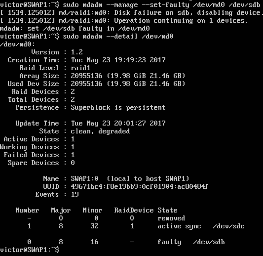

Una vez vemos que disco esta fallando, hay que extraerlo con ``` sudo mdadm --manage --remove /dev/md0 /dev/sdb ```

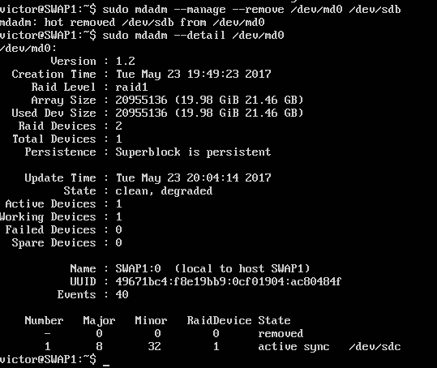

Ya hemos extraído el disco, ahora solo nos falta añadir uno nuevo para que siga funcionando en RAID: ``` sudo mdadm --manage --add /dev/md0 /dev/sdb ```

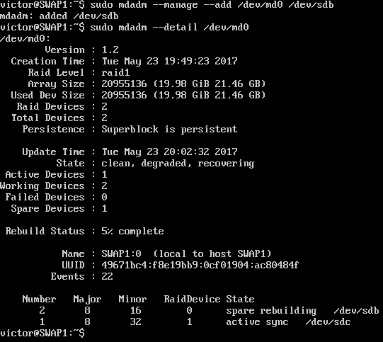
